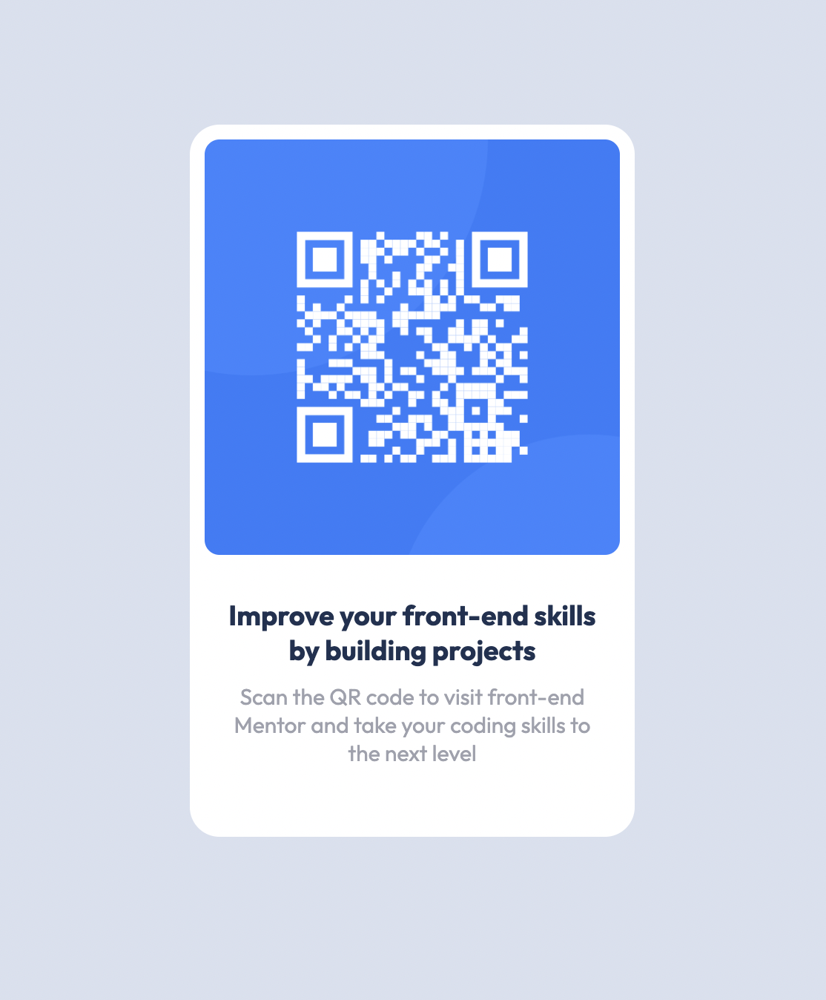

# Frontend Mentor - QR code component solution

This is a solution to the [QR code component challenge on Frontend Mentor](https://www.frontendmentor.io/challenges/qr-code-component-iux_sIO_H). Frontend Mentor challenges help you improve your coding skills by building realistic projects. 

## Table of contents

- [Overview](#overview)
  - [Screenshot](#screenshot)
  - [Links](#links)
  - [Built with](#built-with)
  - [Continued development](#continued-development)
  - [Useful resources](#useful-resources)
- [Author](#author)

**Note: Delete this note and update the table of contents based on what sections you keep.**

## Overview

    This project is focused on creating a desktop and mobile friendly qr code component 

### Screenshot

### Links

- Live Site URL: [https://timely-sprite-b60a48.netlify.app/]

### Built with

- Semantic HTML5 markup
- CSS custom properties
- Flexbox
- MediaScreen
- Mobile-first workflow

### What I learned

If you want more help with writing markdown, we'd recommend checking out [The Markdown Guide](https://www.markdownguide.org/) to learn more.

### Continued development

more imprrovement on use of flex and grid 

### Useful resources

- [https://developer.mozilla.org/en-US/docs/Web/CSS/CSS_Flexible_Box_Layout/Aligning_Items_in_a_Flex_Container] - This helped me for using flex to align items to the center.

## Author

- Frontend Mentor - [@okobi45](https://www.frontendmentor.io/profile/okobi45)

